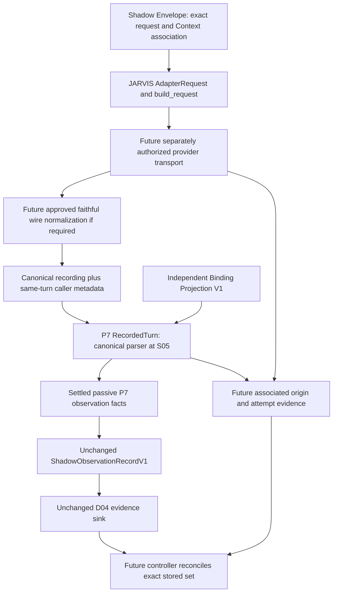

# Canonical parser and external origin association

No provider/client/server->ToolProposal factory edge, no binding->fake proposal, no sink->authenticity decision, no dispatcher/audit/P2/provider activation. Future transport/normalizer/collector paths are conceptual and not implemented or assigned modules here.
