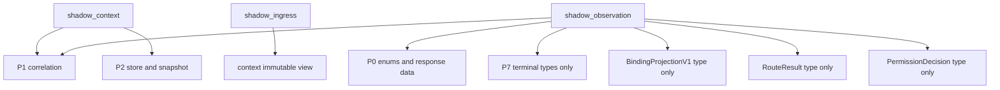

# Proposed bounded import graph

No new file or edge has been implemented. Context→ingress is a data handoff; only ingress may import context after approved implementation. No reverse dependency or package re-export. Observation reads settled types but never calls their engines. No server/API/UI/Hermes/evaluator/scheduler consumer, and no sink/provider/audit/dispatcher/registry edge. The proposed graph still requires the named source-gate transitions; type-only use is not exempt from current tests.
