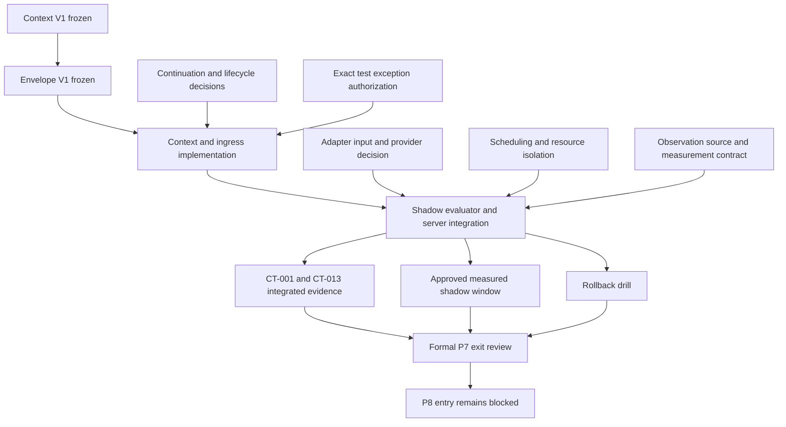

# Remaining dependency graph

F-MAP-01 producer/registry snapshot and recorded P7 are already implemented. They do not provide live adapter data or measurement delivery. No graph edge authorizes implementation. The old single _process collection point is refined by the explicit REST/WS contract, but evaluator placement still requires a scheduling decision. Existing server/API/UI dependency remains, including how a JARVIS-issued continuation handle is conveyed.
