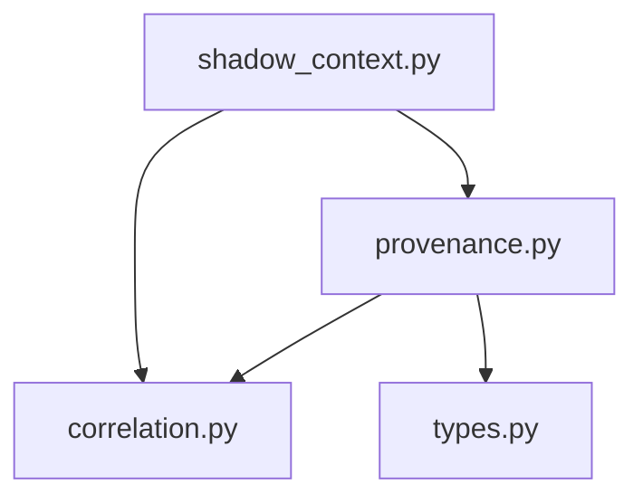

# Exact production import graph and call boundary

Direct symbols: P1 `CorrelationContext`, `SessionId`, `is_well_formed_id`, `new_session_id`, `new_turn_context`; P2 `LedgerSnapshot`, `LedgerStore`, `ProvenanceRecord`, `validate_record`. Direct standard-library imports: `__future__.annotations`, `dataclasses.dataclass`, `datetime.datetime`, `types.MappingProxyType`.

Transitive production imports: provenance imports only correlation and types; correlation and types have no further application imports. `app/__init__.py` has no imports; execution/__init__.py is docstring-only. `import-graph.json` inventories exact symbols and all standard-library edges of this closure (uuid/dataclasses/datetime/typing, and re/threading/types/enum).

Owner call paths are session mint/ID validation, turn mint, store constructor/for_session, ledger constructor/snapshot, and record/immutable-data validation. Existing P2 validation calls freeze_value to check allowed values, not `_build`, `_append`, writers, drop or clear. P2 contains recorder APIs elsewhere; their presence is not a context execution edge. Actual runtime traps cover those APIs. No app import can lead to dispatcher, executor, registry, provider, Hermes, confirmation machine, observability, audit, server or tools. UUID entropy and P2 lock allocation are passive foundation behavior, not network/model activity.
