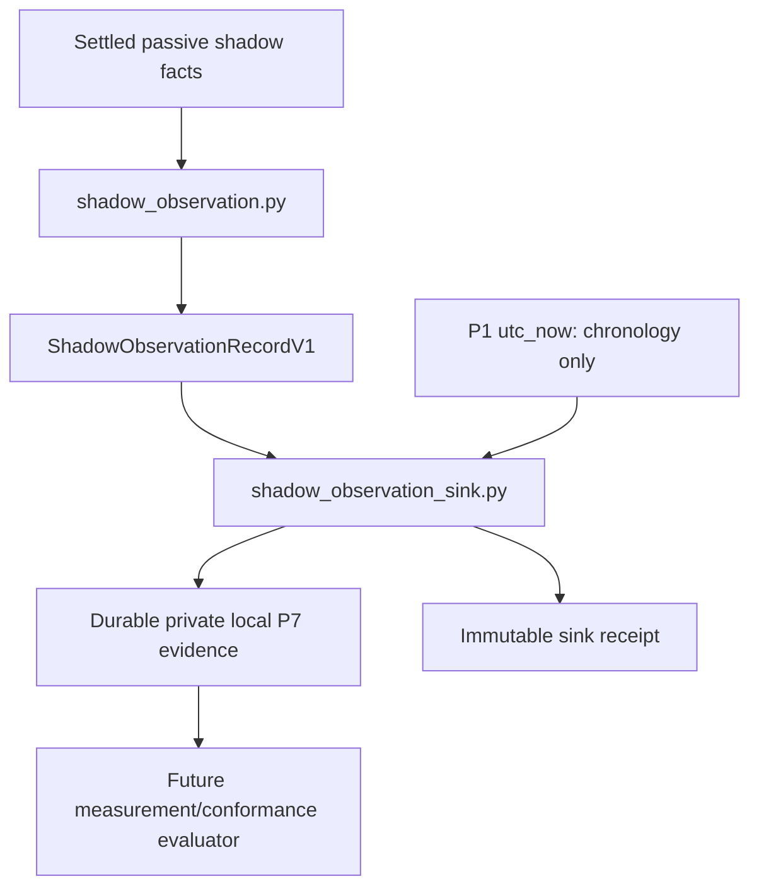

# Future conceptual graph

No sink edge to dispatcher, registry, provider/model, audit-v3 or P2. A future controller must reconcile independent attempts/submissions/receipts with the durable set; its scheduler/window/attempt schema is not frozen here. No production consumers/imports/wiring added.
