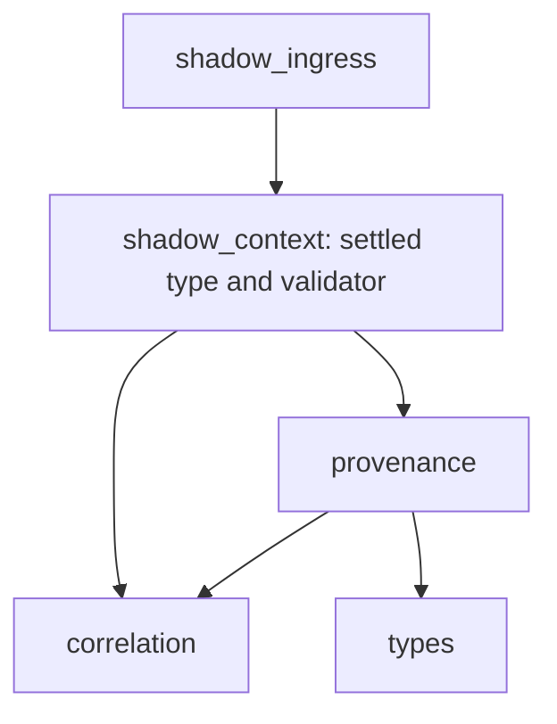

# Exact import and execution boundary

Direct imports: `__future__.annotations`, `dataclasses.dataclass`, `app.execution.shadow_context.SettledShadowTurnContextV1`. No alias/re-export. App and execution package initializers have no imports and remain unchanged.

`import-graph.json` lists exact module/symbol edges for the five-module production closure, including all stdlib imports. The closure contains existing P2 recorder definitions and the owner definition; import presence is not an ingress call path. Ingress reaches only `type`, error construction and the settled validator. Validation reaches existing P1 shape checks, immutable graph checks and P2 record validation/freeze-value checking; it never reaches owner construction, minting, P2 acquisition/writer, dispatcher, executor, registry, Hermes/provider/model, pipeline, confirmation, audit or server.

Cold ingress import and guarded composition trap actual prohibited mutation, minting, allocation, snapshot, networking and process surfaces. This distinguishes passive import closure from execution reachability without making a false claim that P2 APIs disappear.
