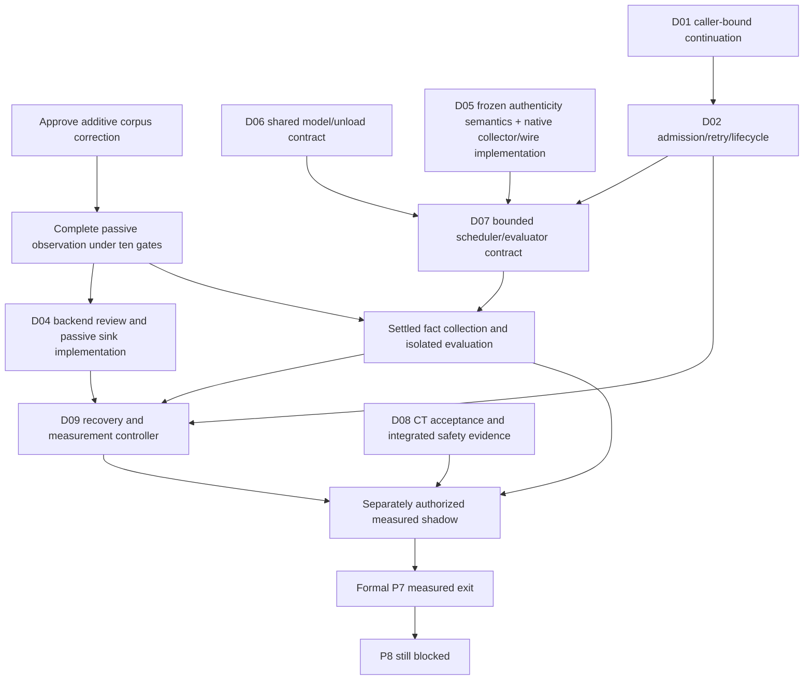

# Read-only Formal P7 dependency review

This is a readiness inventory, not approval or implementation. Observation remains absent after candidate restoration; D03 contract is frozen, not implemented. Context and ingress are implemented/unwired. No formal measured P7 exit or P8 entry is established. No live host/resource/provider operation was performed.

| Unit | Current readiness / decision | Exact files/functions or frozen owners | Existing gates relevant to a future unit | Risk |
|---|---|---|---|---|
| D03 observation | Current C01 corpus revision blocks acceptance; ten existing gate relationships already approved | Proposed app/execution/shadow_observation.py::build_shadow_observation; eighteen fields; packet exact source/test patch | authorization/ten-row-freeze.json contains all ten exact functions; no additional existing transition found | Low runtime impact; medium validation/evidence integrity |
| D04 sink | Semantic contract frozen; backend/barrier/recovery/concurrency plan still needed; observation must exist first. A passive offline implementation can be separately authorized without server wiring | Future app/execution/shadow_observation_sink.py; ShadowObservationSinkReceiptV1. CLOCK selects correlation.utc_now. STORAGE_AUTHORITY selects PROJECT_ROOT/data private local namespace; no concrete leaf/backend chosen | Current observation absence gates need only the already approved D03 transitions. Future observer zero-consumer tests/helper must be narrowly versioned for sink's exact record-type import; proposed helper also forbids sink presence. Exact future exception set must include those helper/caller relationships rather than delete bans. No current sink-specific test inventory is claimed because it does not exist | Medium: durable uncertainty, path/privacy, crashes |
| D06 shared model ownership | Unresolved contract; single shadow generation cap does not protect all legacy generations or unload | app/resource_manager.py::ResourceManager.light_sleep:198, deep_sleep:223, _unload_ollama_models:455, unload_all_ollama_models:559, unload_ollama_model:575, preload_ollama_model:610; app/brain/llm_client.py::LLMClient._chat_with_model:136, _call_chat:192, _stream_response:209, _call_with_recovery, _stream_with_recovery | tests/test_resource_manager.py::test_light_sleep_unloads_services_and_keeps_wake_listener, test_deep_sleep_stops_wake_listener_and_processes, test_unload_ollama_model_uses_keep_alive_zero (exact payload keep_alive=0); tests/test_llm_client_payload.py payload checks. Adding app.execution imports in lifecycle/LLM files would hit execution/non_activation_test.py::test_only_config_and_passive_adapter_reference_the_execution_package and named live-path bans. Contract-only work changes none | High: legacy resource interference |
| D07 scheduler/evaluator | Still dependent on D06, source collection/authenticity and admission semantics; no mechanism/numeric bounds selected | Existing app/server.py::lifespan asyncio.create_task/to_thread; app/agent/task_queue.py::TaskQueue, _get_lock, _save; app/agent/scheduler.py::Scheduler.start/stop/_register_job (APScheduler); CancelToken uses threading.Event; future scheduler/evaluator paths not implemented | Pipeline shared assert_presence and the exact observer/context/ingress consumer gates; all named server/nonactivation import and mode-reader bans remain. tests/test_scheduler.py and task/server route tests cover current product scheduling, not a shadow worker authorization. New imports/consumers require exact review after mechanism chosen | High: overload, duplicate work, remote completion |
| D01/D02 continuation/admission | Neither opaque credential transport/binding nor retry/reconnect/lifecycle is frozen | app/server.py::chat:358 starts http trace:359, _process(req.message):369; ws_endpoint:497 receives/parses message:505-511, trace websocket:524, _process_stream:527 and _process fallback:529; _api_token_ok/_ws_authorized/_ws_origin_allowed remain existing owners | tests/test_server_auth.py token/origin cases remain intact; execution/non_activation_test.py::test_request_path_modules_are_untouched_by_the_contract, router_non_activation_test.py live request-path and exact app.execution references, classifier/lane/canonicalize/permissions/provenance/audit nonactivation gates, context/ingress zero consumer gates | High: fixation, cross-session disclosure, duplicate turns |
| D08 CT-001/CT-013 | Operator acceptance interpretation/integrated evidence unresolved; original CT definitions preserved | tasks/task13b10d/CONFORMANCE_TESTS.md CT-001/CT-013; tasks/p7-autonomous-d06-d07-closure/CT_ANALYSIS.md; future isolated integration harness | Original phase/conformance documents remain authoritative. Passive pipeline/observation source/lane tests are support, not a literal visible-response or integrated safety pass. No authorized replacement assertion exists | High: false conformance/privacy |
| D09 controller/window | Window boundaries, attempt accounting, recoverable independent submissions, thresholds still require contract/operator decisions | Future controller path not selected. D04 LOSS_ACCOUNTING: A eligible attempts, B submissions, C durable entries, D nonacceptance; B=C/D=0 necessary, A=B not frozen. D05 authentic classification/receipts separately joined | Existing pipeline corpus, golden scenarios and D03/D04 fixed schema/security tests are offline floors, not live thresholds. No measurement controller implementation/public test API exists; exact gates must be inventoried once its path/callers are frozen | High: silent loss/duplicate inflation |

D06 narrow contract choices: identify one owner of admission/in-flight accounting across legacy and shadow; decide lease acquisition/release, unload defer/refuse/drain behavior for manual sleep/idle transitions, cancellation/timeout and remote completion acknowledgement, release after disconnect, crash recovery and how legacy behavior remains unchanged. Current unload_all_ollama_models merges loaded/configured model names and calls /api/generate with keep_alive=0 (CLI stop fallback). It has no reviewed shared in-flight generation interlock. Do not select a mechanism or change that payload/lifecycle in this unit.

D07 primitives are candidates only. TaskQueue persists ordinary goals by rewriting JSON; it is not a bounded shadow queue or durable evidence ledger. Scheduler runs product jobs; background tasks/to_thread do not establish bounded admission or cancellation. CancelToken.cancel only sets a local Event. Closing a local HTTP stream or cancelling a local task does not prove remote inference stopped. Existing 600-second timeout/retry logic is legacy behavior, not a newly approved shadow budget. D06 remains a prerequisite.

D04 next sink design must name exactly one backend and demonstrate a local durability barrier, append-only retained history, serialized unique positive order across restart/concurrency, six-field explicit entry encoding/integrity, five-field accepted/nonaccepted receipt, private path confinement/symlink handling, partial/corrupt artifact preservation, and uncertain commit/acknowledgement reconciliation. Clock is one aware UTC correlation.utc_now sample; it is chronology, not latency. No automatic pruning/overwrite/audit/P2 fallback. Known loss/uncertainty invalidates affected coverage. B=C cannot prove eligible upstream attempts were all observed; controller/admission accounting remains separate. Backend mechanics are implementation choices constrained by the frozen semantics, not a new permission to persist in this session.

D01/D02 require a JARVIS-issued caller-bound continuation protocol shared across REST/WS, authority-preserving resolution before owner use, retry/idempotency semantics, owner capacity/expiry/concurrency and rollback cleanup. Equal text, equal trace strings and a client-supplied UUID cannot decide identity. Existing auth is not automatically a new session credential design. No cookies/headers/token choice was made.

D08 CT-001 requires control-plane final visible output and retained-draft audit evidence; legacy-visible/no-audit-change inert shadow cannot itself satisfy both. CT-013 needs actual integrated conversational safety/leakage evidence, not just MODEL_RAW/lane labels. Do not reinterpret either. D09's historical pilot suggestions (169 cases/24 hours) are explicitly unapproved recommendations, not frozen thresholds. No current live traffic or latency measurement was made.

Recommended order: (1) one C01 corpus revision batch and complete this passive observer; (2) independently freeze D06 shared ownership/unload contract; (3) review D04 local backend/fault plan and its exact record-type consumer gates, then separately authorize passive sink; (4) settle D01/D02 and implement faithful D05 source collection within approved ownership; (5) freeze D07 queue/admission/cancellation and evaluator fact collection, plus D09 recoverable controller scope; (6) explicit D08 and D09 window/threshold acceptance decisions; (7) only then separately authorize live integration, measurement and rollback drill. Contract-only D06/D01/D02/D08 work may proceed independently as read-only decision preparation, not production implementation. The smallest immediate supervised unit is C01 plus observer completion. After observer success, the smallest ownership blocker is the D06 contract decision packet; D04 backend review is an independent passive branch.

Nothing after observation was implemented. Exact future exception counts cannot honestly be assigned before those still-unselected mechanisms and consumers are specified; the files/functions above are the current gate surfaces, not blanket authorizations.
