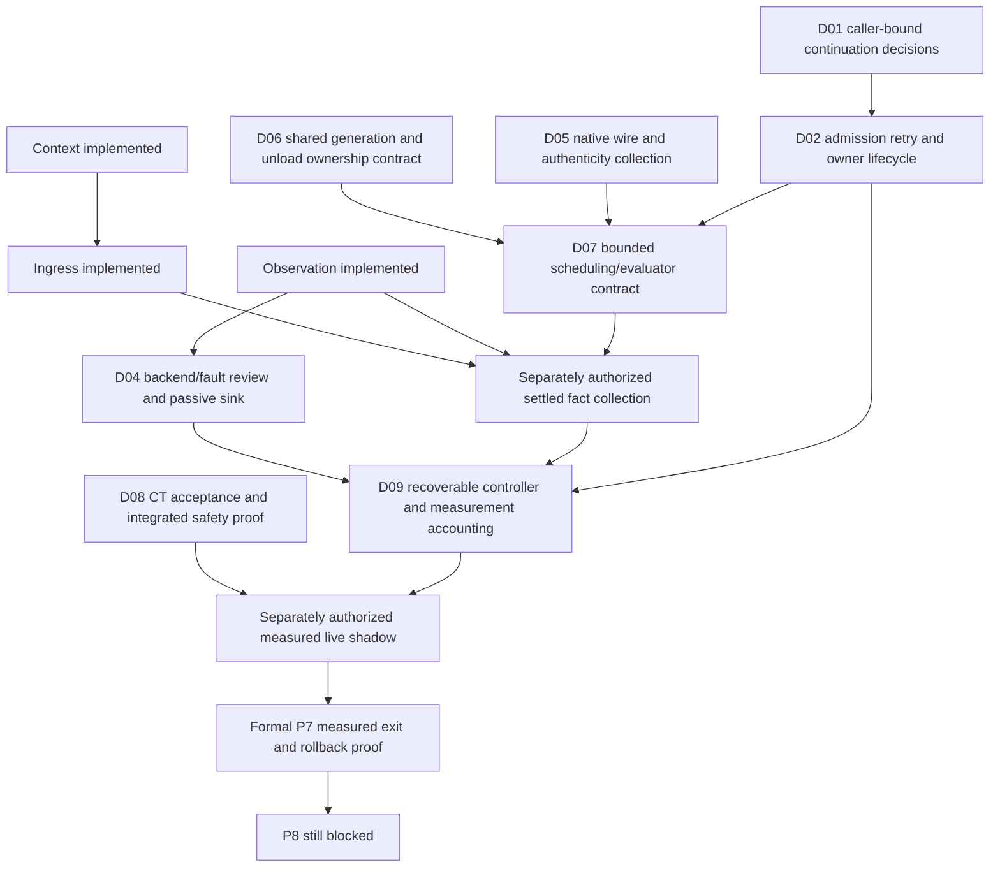

# Fresh read-only Formal P7 dependency review

D10 passive context, ingress and observation are implemented and unwired. This closes the observation implementation/import authorization unit, not formal measured P7 exit. P8/13C remain blocked. No next runtime unit was implemented, no live traffic or lifecycle/network/model operation was performed.

| Unit | Readiness and exact next action | Likely production files / current owners | Existing gates / operator decisions | Risk |
|---|---|---|---|---|
| D04 | Semantic contract frozen; observer dependency now available. Offline sink can be separately implemented after backend/fault plan and two precise helper transitions | Future app/execution/shadow_observation_sink.py only; observer record; correlation.utc_now; pipeline stage/reason enums for typed recovery | observation_test::assert_observation_structure and pipeline_contract_support::assert_presence. Private namespace, durable append/barrier/recovery plan, active backup/Core-only check. No server wiring | Medium |
| D06 | Contract-only first; no existing shared generation/unload policy | app/resource_manager.py, app/brain/llm_client.py, app/brain/cancel_token.py; selected future provider owner | resource tests preserve sleep actions and keep_alive=0; model payload/recovery tests; external execution-package/live-path bans. Choose owner, leases, selected owned model set, unload disposition and remote completion proof | High |
| D07 | Still blocked by D06; mechanism/admission/cancellation/fact collector not frozen | Future shadow_scheduler.py/shadow_evaluator.py; existing server tasks, agent task queue/scheduler, cancellation token | Observer helper explicitly forbids both modules; zero context/ingress/observer consumers and PB04/input owner import budgets. Queue/timeout numerics and overload policy require approval | High |
| D01/D02 | Contract-only authority choices remain before live transport/owner use | app/server.py::chat:358, ws_endpoint:497; future context admission/continuation adapters | Current server_auth token/origin tests and all request-path/nonactivation/consumer gates. Caller binding, retries, cross-transport reconnect, limits, cleanup and concurrency unresolved | High |
| D05 remaining implementation | Recorded parser/authenticity semantics frozen; live prompt/wire/normalizer/collector still missing | app/brain/hermes_adapter.py recorded parser; future native provider/receipt owners not selected | Hermes nonactivation, exact adapter/PB04 budgets and default-disabled flags. No source-authenticity assertion from a hand-built record | High |
| D08 | Operator interpretation and integrated proof, no production implementation authorization | task13b10d/CONFORMANCE_TESTS.md:26 CT-001 and :117 CT-013; closure CT_ANALYSIS.md | CT-001 visible control-plane result plus retained draft audit conflicts with inert legacy-visible/no-audit scope. CT-013 needs authentic same-turn integrated safety/leakage evidence | High |
| D09 | Controller/window contract first; sink alone insufficient | Future measurement controller path unselected; D04 receipts/entries and upstream admission/evaluator facts | Recoverable A/B/C/D and set joins, uncertain/duplicate/pre-context failures, scope/window/sample/rate/latency decisions; 169 cases/24h are unapproved recommendations | High |

Fresh current test-tree sweep scanned 152 Python files and 3134 AST assertions. Exact function/source/assertion inventories: D04 190 candidate functions, D06 141, D07 119, D01/D02 301, D08/D09 105. These are overlapping review surfaces, not counts of required exceptions. D04's minimal direct typed-recovery design identifies two existing helper functions requiring narrow semantic versioning and no other direct conflict; no other unit has an honest final exception count before its owner/mechanism is selected. Future changes must be checked against the recorded complete inventory, not a blanket allowance.

Recommended order: (1) D04 consolidated backend/fault/gate batch, then its separately authorized passive implementation; (2) in parallel decision work only, freeze D06 ownership contract; (3) settle D01/D02 and remaining faithful D05 collector/wire; (4) D07 bounded scheduler/evaluator with exact collector observations and remote completion; (5) D09 independent recoverable controller/accounting; (6) explicit D08 acceptance and D09 window/threshold decisions; (7) separately authorized integration, supervised measurement and rollback drill. Contract decisions can be prepared independently without activating runtime. No numeric queue, timeout, sample or threshold was guessed.

Smallest next supervised unit: **D04 passive sink backend/fault-plan review plus the two exact gate authorizations in D04_GATE_REPLACEMENTS.md**. The ready-to-run plan is NEXT_UNIT_PLAN.md. D06 ownership-only contract is the independent highest-priority risk decision; its production lifecycle changes stay separate.
