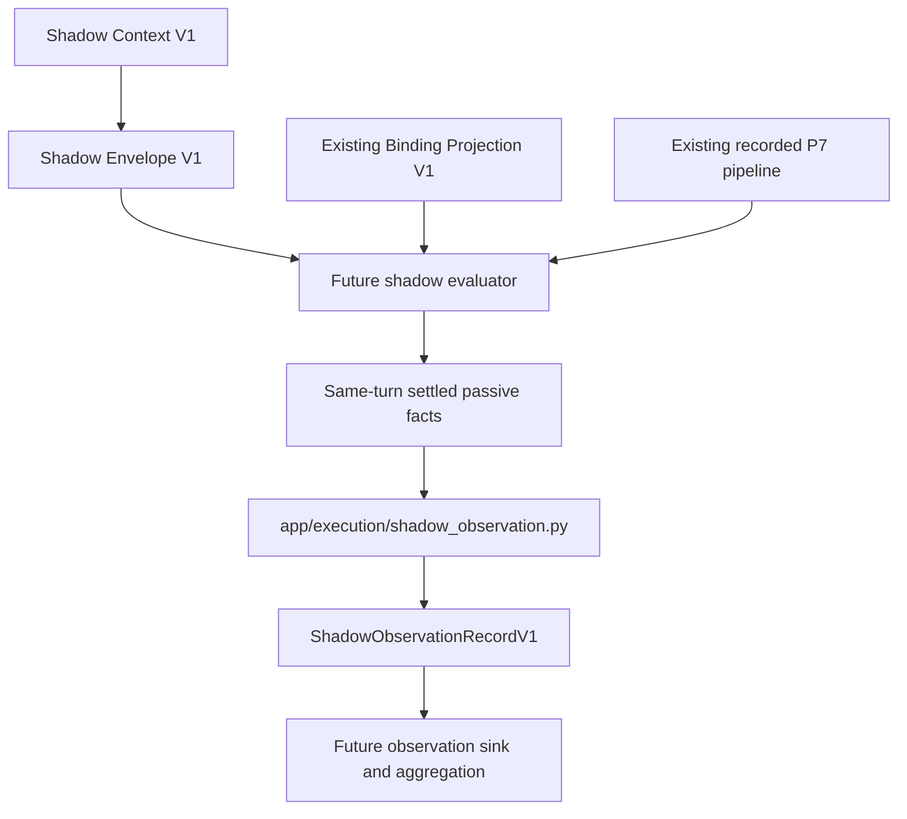

# Conceptual graph only

No direct producer edge to audit-v3, provenance, dispatcher, registry, model/provider, server/HTTP/WS, clock or persistence. The sink has no selected module path, storage format or scheduling policy. Context/envelope are association sources; the producer receives their settled identity/trace rather than retaining their raw/P2 graph.

No production consumer graph changes now. Future imports of pipeline, binding, route/permission and response-source types may hit exact non-activation consumer/symbol gates. The existing 26-site inventory is evidence only; this contract grants no test changes, dynamic import bypasses or broad allowlists. An implementation task must present its exact type/import/API budget separately.
